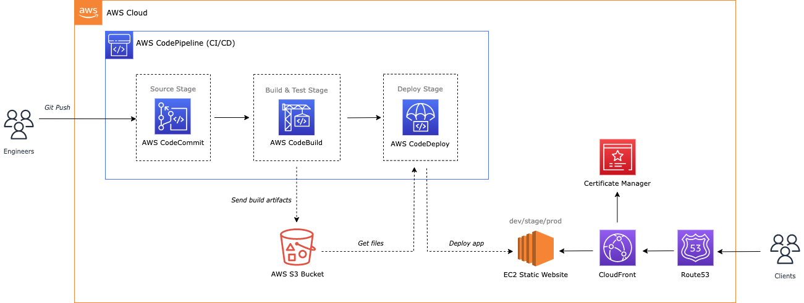

# Deploy Dash
_Automated CI/CD pipeline for deploying a static website on AWS._

## Overview
This repository is powered by **AWS CodePipeline** for continuous integration and deployment. The pipeline automates the process from source control to deployment on an **EC2 Static Website**, fronted by **CloudFront** and managed via **Route53**.

## 📌 Diagram


## Architecture Workflow
1. **Engineers push code** to **AWS CodeCommit** (Source Stage).
2. **AWS CodePipeline** triggers **AWS CodeBuild** (Build & Test Stage).
   - CodeBuild compiles, tests, and creates artifacts.
   - Artifacts are stored in an **S3 bucket**.
3. **AWS CodeDeploy** fetches artifacts from S3 and deploys them to the **EC2 instance** (Deploy Stage).
4. **CloudFront** ensures fast content delivery with caching.
5. **Route53** handles domain name resolution.
6. **AWS Certificate Manager** provides SSL certificates for secure access.

## AWS Services Used
- **AWS CodeCommit** → Source control repository.
- **AWS CodePipeline** → Manages the CI/CD workflow.
- **AWS CodeBuild** → Builds and tests the application.
- **AWS CodeDeploy** → Automates deployment to EC2.
- **Amazon S3** → Stores build artifacts.
- **Amazon EC2** → Hosts the static website.
- **AWS CloudFront** → Caches and accelerates content delivery.
- **Amazon Route 53** → Manages DNS and domain resolution.
- **AWS Certificate Manager** → Manages SSL/TLS certificates.

## Setup & Deployment
### Prerequisites
- AWS account with necessary IAM permissions.
- AWS CLI installed and configured.
- AWS CodeCommit repository set up.

<!-- ### Clone the Repository
```sh
git clone https://git-codecommit.<region>.amazonaws.com/v1/repos/<your-repo-name>
cd <your-repo-name>
```

### Configure AWS CLI
Ensure AWS CLI is set up correctly:
```sh
aws configure
```

### Push Code to AWS CodeCommit
```sh
git add .
git commit -m "Initial commit"
git push origin main
``` -->

### Monitor Deployment
- Open **AWS CodePipeline** in the AWS Console.
- Check **CodeBuild logs** for build status.
- Validate deployment on the **EC2 instance**.

## 🚀 Deployment Stages
| Stage          | Service Used        | Description |
|---------------|-------------------|-------------|
| **Source**   | AWS CodeCommit    | Engineers push code to the repository. |
| **Build & Test** | AWS CodeBuild | Code is built, tested, and artifacts are stored in S3. |
| **Deploy** | AWS CodeDeploy | Artifacts are deployed to EC2. |
| **Delivery** | CloudFront, Route 53 | Ensures fast and secure access to the website. |


## 📖 Resources
- [AWS CodePipeline Documentation](https://docs.aws.amazon.com/codepipeline/latest/userguide/welcome.html)
- [AWS CodeBuild Guide](https://docs.aws.amazon.com/codebuild/latest/userguide/welcome.html)
- [AWS CodeDeploy Docs](https://docs.aws.amazon.com/codedeploy/latest/userguide/welcome.html)
